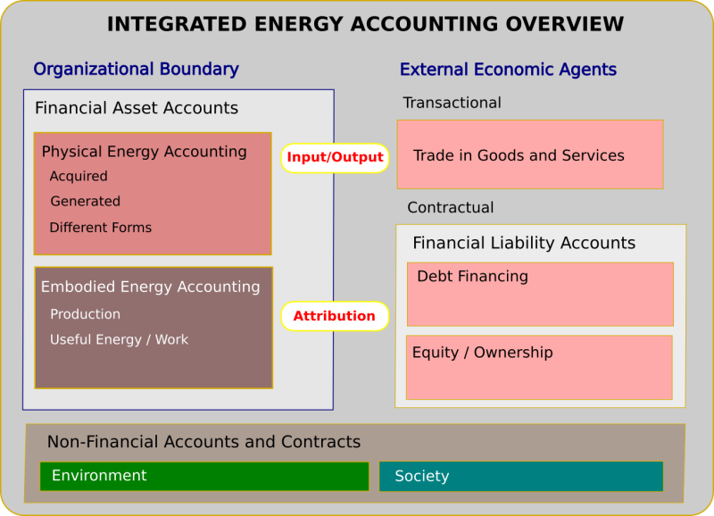
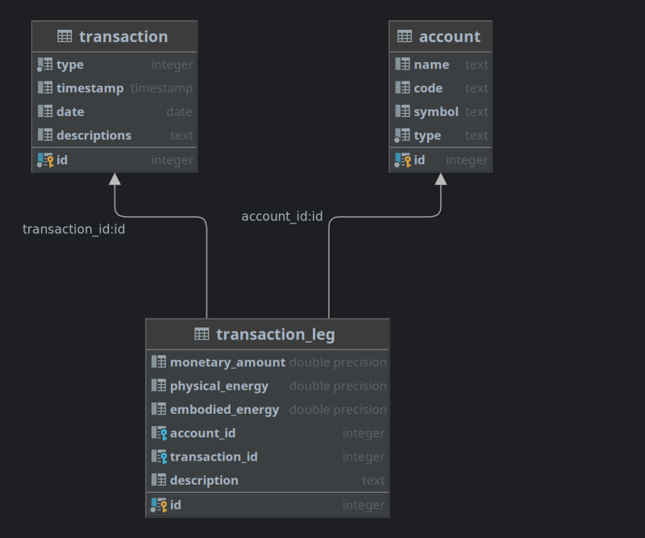

## energyLedger

The **energyLegder** project is an SQL implementation that demonstrates schema designs for *Integrated Energy Accounting*. 


### What is Integrated Energy Accounting

**Integrated Energy Accounting** (IEA) is a multidimensional generalization (superset) of traditional double-entry bookkeeping that is interesting in the context of **Sustainability Reporting**. The simplest summary is that IEA keeps consistently and simultaneously track of both monetary *and* energy flows for all economic transactions of an accounting entity.   

The conceptual framework for IEA has been discussed in two Open Risk White Papers:

* [Deep-Linking Financial and Energy Accounting](https://www.openriskmanagement.com/white_paper_deep_linking_financial_and_energy_accounting/). This paper is a more conceptual and mathematical approach.
* [Integrated Energy Accounting in Relational Databases](https://www.openriskmanagement.com/white_paper_integrated_energy_accounting_using_relational_databases/). This paper is more concrete, implementation oriented discussion that offers some worked out examples.




### Implementation 

The implementation included in this repository is built using the **Postgres database** (Version 15). 

The [file energyLedger0.1.sql](energyLedger0.1.sql) is a complete dump of a functional energyLedger database schema.

You should be able to load it into an existing postgres installation using something like:

```bash
   psql -U username -d dbname < energyLedger0.1.sql
```

This command will automatically
* create the required tables
* install the required triggers and 
* insert a demo set of transactions (see the above White Paper for context and further explanations).

### Schema Structure

The simplified and stylized schema of energyLedger has three tables as per the below diagram. These are further discussed below.



### The Accounts Table

The **Accounts Table** represents the core index of measurable items in the accounting system. 

This table does not hold numerical data. It only catalogs relevant attributes of accounts. Account attributes will be names, codes, types of various forms (e.g. Internal versus External Account Type) etc. 

The Account table is only a container. We need to populate it with our specific *Chart of Accounts*. This will be a sequence of insert statements performed only when initializing the accounting system.

### The Transactions Table

Transactions are at the core of an accounting system. A transaction is a single record in the accounting ledger. It is the conceptual representation of a self-contained business transaction. 

The **Transactions Table** does not hold the actual numerical transaction data. It works, effectively, as a reference (key) for transaction data sets that will be stored separately as the _legs_ or components of the transaction. This design allows for an arbitrary number of transaction legs per transaction and overall easier accommodation of varying types of transactions.

A critical attribute of a Transaction record in the context of integrated energy accounting is whether the transaction is purely internal (does not involve exchanges with entities outside the organizational perimeter) or external (involves in or outflow). This internal/external attribute helps enforce additional constraints where applicable.

A Transaction record does not indicate either amounts or, indeed which accounts are affected. That information is contained in the _Transaction Legs Table_ which in turn links to both the Transactions and Account Tables.

### The Transactions Leg Table

The **Transactions Leg Table** contains the actual transaction data (the numbers of double entry bookkeeping). 

Each transaction leg references 
* the Transaction it is part of
* the Account it is affecting and 
* the values to be added or subtracted from accounts 

The values are multidimensional, they capture consistently all the measured dimensions (monetary, different forms of energy etc.). 

The mechanism of adding columns to the transaction leg table means that a large number of different concurrently measured qualities of an account can be accommodated. 

The accounting logic is implemented through the following construct: The Transaction Leg entries associated with a Transaction entry must be successfully completed (or otherwise none can be completed). This is the primary means to implement **double entry balance constraints and thermodynamical law constraints**.

## Database Triggers

There are three non-trivial triggers implemented:

* The Function **check_kirchhoff_law** implements the _Balance Sheet Constraint_ across all accounted qualities (money, different forms of energy)
* The Function **check_first_law** implements the _Energy Conservation Low_ for _internal transactions_ (that do not see in/outflow of energy from external accounts)
* The Function **check_second_law** implements the _Entropy Increase Law_ for internal transactions


## Transaction Data Insertion

Data insertion into an operational system will consist of inserting transactions and their associated transaction legs. 

A transaction can have any number of legs associated with it. The transaction legs will have numerical values for the types of measurements (money, energy) that are non-zero. The complete SQL code has a longer list of transaction examples. 

### Warning

The energyLedger schema does not provide a fully functioning integrated accounting system. It is simply a demonstration of the main conceptual generalizations and constraints that must be implemented to extend conventional (monetary) accounting in the direction of consistent low-level accounting of physical and embodied energy along financial considerations.


## Feedback

We welcome feedback through any meaningful channel
* here (via issues)
* at the [Open Risk Commons](https://www.openriskcommons.org/c/equinox/energyledger/33) 
* or our [reddit sub](https://www.reddit.com/r/open_risk/).